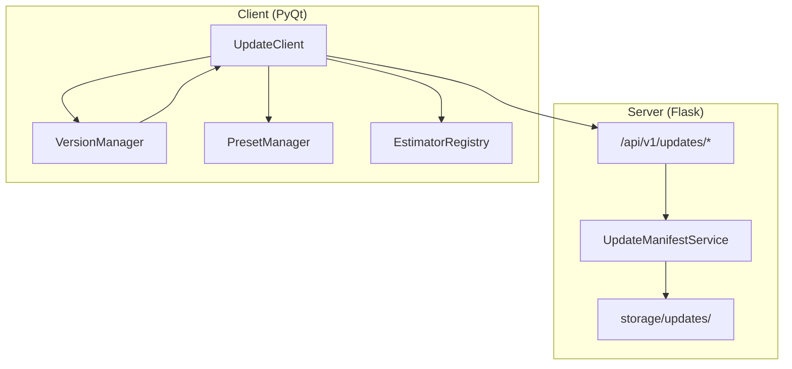
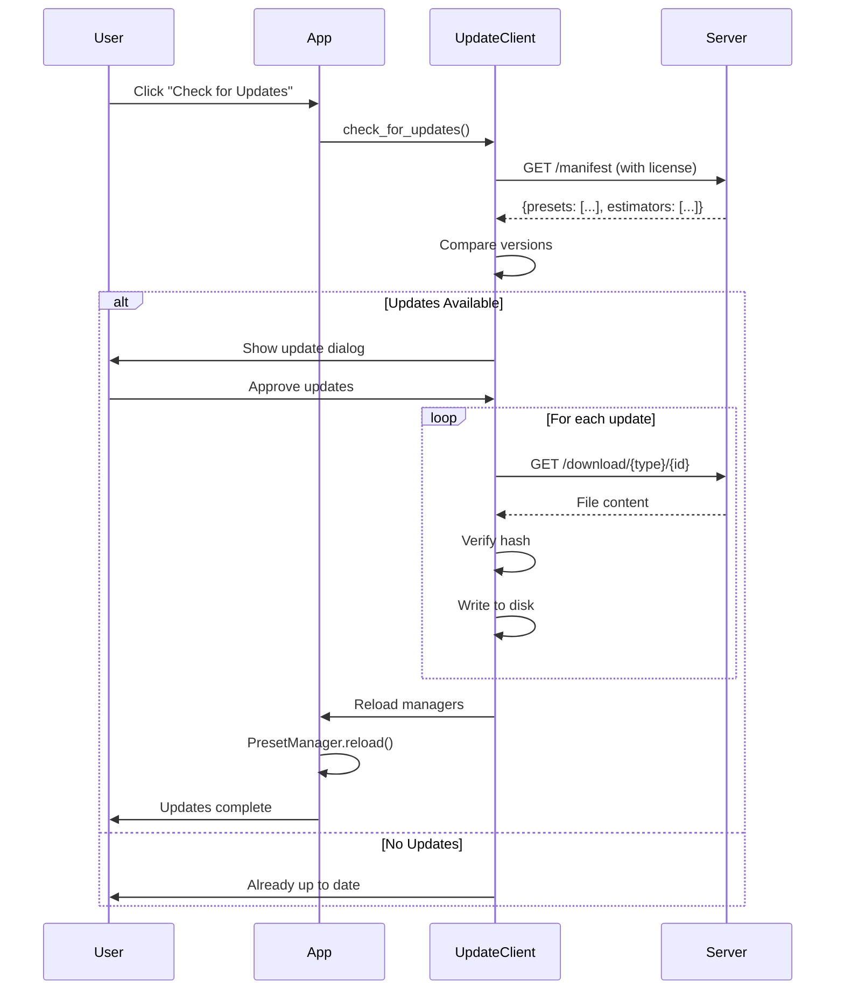

# Remote Update System

## Overview

The Remote Update System enables the application to receive updates for **presets** and **estimators** from a central server without requiring full application updates. This allows for rapid deployment of new features, bug fixes, and improvements.

## Architecture



### Key Principles

1. **Non-invasive**: Presets and estimators remain in their current locations
2. **Incremental**: Only changed files are downloaded
3. **Offline-friendly**: App works without updates using bundled versions
4. **License-gated**: Updates require valid license

---

## Server Components

### API Endpoints

#### `GET /api/v1/updates/manifest`

Returns manifest of available updates.

**Request Headers:**
```
Authorization: Bearer <license_key>
```

**Response:**
```json
{
  "presets": [
    {
      "id": "_RealESRGAN_img",
      "version": "1.2",
      "hash": "sha256:abc123...",
      "path": "upscalers/_RealESRGAN_img.yaml"
    }
  ],
  "estimators": [
    {
      "id": "loop_av1_v7",
      "version": "7.0",
      "hash": "sha256:def456...",
      "type": "loop"
    }
  ]
}
```

#### `GET /api/v1/updates/download/preset/{id}`

Downloads preset YAML content.

**Response:** Raw YAML file content

#### `GET /api/v1/updates/download/estimator/{id}`

Downloads estimator Python content.

**Response:** Raw Python file content

### Service Layer

**`server/services/update_manifest.py`**

```python
class UpdateManifestService:
    def generate_manifest(self) -> dict:
        """Scan storage/updates/ and build manifest"""
        
    def get_preset_content(self, preset_id: str) -> str:
        """Read preset YAML from storage"""
        
    def get_estimator_content(self, estimator_id: str) -> str:
        """Read estimator Python from storage"""
        
    def calculate_hash(self, content: str) -> str:
        """Generate SHA256 hash for integrity"""
```

### Storage Structure

```
server/storage/updates/
├── presets/
│   ├── upscalers/
│   │   ├── _RealESRGAN_img.yaml
│   │   └── _RealESRGAN_4x.yaml
│   ├── video/
│   │   └── new_codec_preset.yaml
│   └── socials/
│       └── instagram_reel_hdr.yaml
└── estimators/
    ├── loop_av1_v7.py
    └── video_hevc_v3.py
```

---

## Client Components

### UpdateClient

**`client/core/update_client.py`**

```python
class UpdateClient:
    async def check_for_updates(self) -> UpdateManifest:
        """Fetch manifest from server"""
        
    async def download_preset(self, preset_id: str) -> str:
        """Download preset YAML content"""
        
    async def download_estimator(self, estimator_id: str) -> str:
        """Download estimator Python content"""
        
    async def apply_preset_update(self, preset_id: str, content: str, subdir: str):
        """Write to client/plugins/presets/assets/presets/{subdir}/{id}.yaml"""
        
    async def apply_estimator_update(self, estimator_id: str, content: str, type: str):
        """Write to client/core/target_size/{type}_estimators/{id}.py"""
```

### Version Tracking

**`client/plugins/presets/assets/update_manifest.json`**

```json
{
  "last_check": "2026-02-06T18:45:00Z",
  "installed": {
    "presets": {
      "_RealESRGAN_img": "1.2",
      "instagram_reel_hdr": "1.0"
    },
    "estimators": {
      "loop_av1_v7": "7.0"
    }
  }
}
```

---

## Update Flow



---

## Deployment Guide

### Adding New Updates

1. **Create/update the file** in your development environment
2. **Increment version** in the file's metadata:
   ```yaml
   meta:
     version: "1.3"  # Increment from 1.2
   ```
3. **Copy to server storage**:
   ```bash
   cp client/plugins/presets/assets/presets/upscalers/_RealESRGAN_img.yaml \
      server/storage/updates/presets/upscalers/
   ```
4. **Deploy server** - manifest auto-generates on request

### Version Guidelines

- **Presets**: Use semantic versioning in `meta.version`
- **Estimators**: Version is in filename (e.g., `loop_av1_v7.py`)
- **Breaking changes**: Increment major version
- **New features**: Increment minor version
- **Bug fixes**: Increment patch version

---

## Security Considerations

1. **License validation**: All endpoints require valid license key
2. **Hash verification**: Client verifies SHA256 before applying
3. **Path sanitization**: Prevent directory traversal attacks
4. **Rate limiting**: Prevent abuse of download endpoints

---

## Testing

### Manual Testing

1. Start local server with test updates
2. Run client and trigger update check
3. Verify files written to correct paths
4. Verify `PresetManager.reload()` picks up changes
5. Test with invalid license (should fail)

### Automated Tests

```python
# Server tests
def test_manifest_generation()
def test_preset_download()
def test_license_validation()

# Client tests
def test_version_comparison()
def test_preset_write_path()
def test_estimator_write_path()
```

---

## Troubleshooting

### Updates not appearing

- Check `update_manifest.json` for last check time
- Verify server manifest includes the update
- Check client logs for download errors

### Files not loading after update

- Call `PresetManager.reload()` after preset updates
- Restart app if estimator updates don't load
- Check file permissions on written files

### License validation fails

- Verify license key is valid and not expired
- Check server logs for validation errors
- Ensure network connectivity to server
