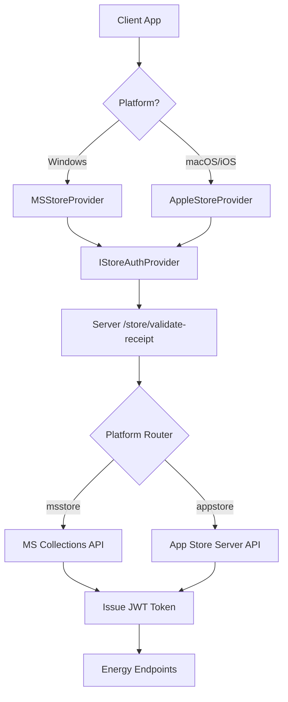
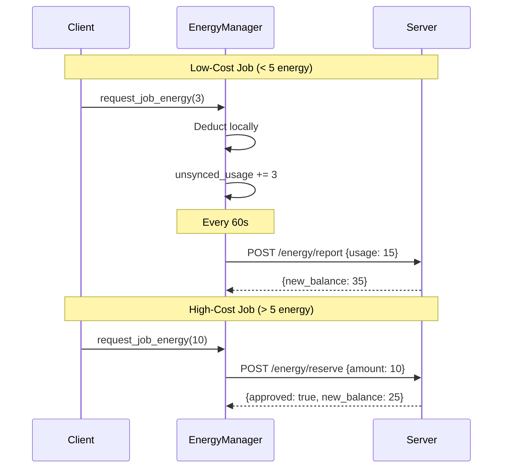

# Store-Native Authentication & Energy System

## Table of Contents
1. [Overview](#overview)
2. [Architecture](#architecture)
3. [Server Implementation](#server-implementation)
4. [Client Implementation](#client-implementation)
5. [API Reference](#api-reference)
6. [Testing](#testing)
7. [Deployment](#deployment)
8. [Migration Guide](#migration-guide)

---

## Overview

This document describes the store-native authentication and energy ledger system that replaces the legacy hardware-locked license key model.

### Key Features
- **Multi-Platform Support**: MS Store and Apple App Store (ready for implementation)
- **JWT Authentication**: Secure token-based auth replacing admin-key headers
- **Energy System**: Usage-based limits for free tier with daily reset
- **Premium Bypass**: Lifetime purchasers have unlimited access
- **Batch Sync**: Optimized server load with 60-second batch reporting

### User Tiers
| Tier | Energy | Reset | Cost |
|------|--------|-------|------|
| Free | 50/day | Midnight UTC | $0 |
| Premium | Unlimited | N/A | One-time purchase |

---

## Architecture

### Multi-Platform Design



### Energy Flow



---

## Server Implementation

### Platform Enum

[license_manager.py](file:///v:/_MY_APPS/ImgApp_1/server/services/license_manager.py#L19-L31)

```python
class Platform(str, Enum):
    MSSTORE = "msstore"       # Microsoft Store
    APPSTORE = "appstore"     # Apple App Store
    STRIPE = "stripe"         # Future: Direct Stripe
    DIRECT = "direct"         # Manual/admin-created
    TRIAL = "trial"           # Free trials
```

### User Profile Schema

Stored in `server/data/user_profiles.json`:

```json
{
  "ms_store_user_123": {
    "store_user_id": "ms_store_user_123",
    "platform": "msstore",
    "energy_balance": 45,
    "is_premium": false,
    "last_energy_refresh": "2026-02-08T00:00:00Z",
    "created_at": "2026-02-01T10:30:00Z"
  }
}
```

### JWT Authentication

[jwt_auth.py](file:///v:/_MY_APPS/ImgApp_1/server/auth/jwt_auth.py)

**Token Payload**:
```json
{
  "sub": "store_user_id",
  "platform": "msstore",
  "is_premium": false,
  "iat": 1707393600,
  "exp": 1707480000
}
```

**Usage**:
```python
from auth.jwt_auth import create_jwt_token, require_jwt

# Create token
token = create_jwt_token(user_id, "msstore", is_premium=True)

# Protect endpoint
@api_bp.route('/energy/sync')
@require_jwt
def energy_sync():
    user_id = get_current_user_id()
    ...
```

### Store Validation

[store_validation.py](file:///v:/_MY_APPS/ImgApp_1/server/services/store_validation.py)

**MS Store Flow**:
1. Get Azure AD access token
2. Call Collections API with receipt
3. Parse product type (lifetime vs energy pack)
4. Return validation result

**Apple Store Flow** (stub):
- Will use App Store Server API
- Requires App Store Connect API key
- Implementation pending Mac dev environment

### Energy Endpoints

All energy endpoints require JWT authentication via `@require_jwt` decorator.

#### Daily Reset Logic

[license_manager.py](file:///v:/_MY_APPS/ImgApp_1/server/services/license_manager.py#L1285-L1317)

```python
def check_daily_energy_reset(store_user_id, profile):
    """Reset energy to 50 at midnight UTC for free tier"""
    if profile.get('is_premium'):
        return  # Premium users skip reset
    
    last_refresh = datetime.fromisoformat(profile['last_energy_refresh']).date()
    today = date.today()
    
    if last_refresh < today:
        profile['energy_balance'] = Config.DAILY_FREE_ENERGY
        profile['last_energy_refresh'] = datetime.utcnow().isoformat()
        save_user_profile(store_user_id, profile)
```

---

## Client Implementation

### Store Provider Interface

[store_auth_provider.py](file:///v:/_MY_APPS/ImgApp_1/client/core/auth/store_auth_provider.py)

```python
class IStoreAuthProvider(ABC):
    @abstractmethod
    def login(self) -> AuthResult:
        """Platform-native login flow"""
        
    @abstractmethod
    def get_store_user_id(self) -> Optional[str]:
        """Return platform user ID"""
        
    @abstractmethod
    def validate_receipt(self, receipt_data: bytes) -> bool:
        """Send receipt to server for validation"""
```

### MS Store Provider

[ms_store_provider.py](file:///v:/_MY_APPS/ImgApp_1/client/core/auth/ms_store_provider.py)

**WinRT Integration**:
```python
from winrt.windows.services.store import StoreContext

async def _get_license():
    license_result = await self._store_context.get_app_license_async()
    # Check for durable add-ons (lifetime purchase)
    addons_result = await self._store_context.get_user_collection_async(["Durable"])
```

**Receipt Validation**:
```python
receipt = await self._store_context.get_app_receipt_async()
response = requests.post(
    f"{API_BASE_URL}/api/v1/store/validate-receipt",
    json={"receipt_data": receipt, "platform": "msstore"}
)
```

### Energy Manager

[energy_manager.py](file:///v:/_MY_APPS/ImgApp_1/client/core/energy_manager.py)

**Batch Sync Timer**:
```python
self._batch_timer = QTimer()
self._batch_timer.timeout.connect(self._flush_unsynced_usage)
self._batch_timer.start(60000)  # 60 seconds
```

**Energy Request Logic**:
```python
def request_job_energy(cost, conversion_type, params):
    if self.is_premium:
        return True  # Bypass
    
    if cost <= SYNC_THRESHOLD_COST:
        # Low-cost: deduct locally
        return self.consume(cost)
    else:
        # High-cost: reserve from server
        return self.api_client.reserve_energy(cost)
```

---

## API Reference

### Store Validation

#### `POST /api/v1/store/validate-receipt`

Validate store receipt and issue JWT token.

**Request**:
```json
{
  "receipt_data": "<base64 encoded receipt>",
  "platform": "msstore" | "appstore",
  "product_id": "imgapp_lifetime" | "imgapp_energy_100"
}
```

**Response**:
```json
{
  "success": true,
  "is_premium": true,
  "energy_balance": 50,
  "jwt_token": "eyJhbGciOiJIUzI1NiIsInR5cCI6IkpXVCJ9..."
}
```

**Errors**:
- `400` - Invalid receipt or missing fields
- `500` - Store API error

---

### Energy Endpoints

All require `Authorization: Bearer <jwt_token>` header.

#### `POST /api/v1/energy/sync`

Get current energy balance from server.

**Request**: `{}`

**Response**:
```json
{
  "success": true,
  "balance": 45,
  "max_daily": 50,
  "is_premium": false,
  "timestamp": "2026-02-08T18:00:00Z",
  "signature": "abc123..."
}
```

---

#### `POST /api/v1/energy/reserve`

Reserve energy for high-cost job (synchronous validation).

**Request**:
```json
{
  "amount": 10
}
```

**Response (Success)**:
```json
{
  "success": true,
  "approved": true,
  "new_balance": 35,
  "signature": "def456..."
}
```

**Response (Insufficient)**:
```json
{
  "success": true,
  "approved": false,
  "error": "insufficient_energy",
  "current_balance": 3,
  "required": 10
}
```

**Status Codes**:
- `200` - Success (check `approved` field)
- `402` - Payment Required (insufficient energy)
- `401` - Unauthorized (invalid JWT)

---

#### `POST /api/v1/energy/report`

Report accumulated local usage (batch sync).

**Request**:
```json
{
  "usage": 15,
  "last_signature": "abc123..."
}
```

**Response**:
```json
{
  "success": true,
  "new_balance": 35,
  "signature": "ghi789..."
}
```

---

## Testing

### Server Unit Tests

Create `tests/server/test_store_validation.py`:

```python
def test_jwt_token_creation():
    token = create_jwt_token("user123", "msstore", is_premium=True)
    claims = verify_jwt_token(token)
    assert claims['sub'] == "user123"
    assert claims['is_premium'] == True

def test_energy_reserve_insufficient():
    # Mock user with 5 energy
    response = client.post('/api/v1/energy/reserve',
        json={'amount': 10},
        headers={'Authorization': f'Bearer {jwt_token}'}
    )
    assert response.status_code == 402
```

**Run Tests**:
```bash
cd v:\_MY_APPS\ImgApp_1
python -m pytest tests/server/test_store_validation.py -v
```

### Client Unit Tests

Update `tests/test_store_auth.py`:

```python
def test_batch_sync_timer():
    energy_mgr = EnergyManager.instance()
    energy_mgr.unsynced_usage = 10
    energy_mgr.jwt_token = "test_token"
    
    # Trigger batch sync
    energy_mgr._flush_unsynced_usage()
    
    # Verify API call was made
    assert energy_mgr.api_client.report_usage.called
```

---

## Deployment

### Environment Variables

Add to PythonAnywhere or production environment:

```bash
# JWT
JWT_SECRET_KEY=<generate_strong_secret>
JWT_EXPIRY_HOURS=24

# Energy System
DAILY_FREE_ENERGY=50
ENERGY_RESET_HOUR_UTC=0

# MS Store (from Azure Portal)
MSSTORE_TENANT_ID=<azure_tenant_id>
MSSTORE_CLIENT_ID=<azure_app_client_id>
MSSTORE_CLIENT_SECRET=<azure_app_secret>
```

### Azure AD Setup

1. Go to [Azure Portal](https://portal.azure.com)
2. Create App Registration
3. Add API permissions: `https://onestore.microsoft.com/.default`
4. Generate client secret
5. Copy Tenant ID, Client ID, and Secret to environment variables

---

## Migration Guide

### For Existing Users

**Hardware-Locked Licenses**:
- Continue to work (backward compatible)
- `hardware_id` field is now optional
- No migration required

**New Store Users**:
- Authenticate via MS Store
- Receive JWT token
- Energy balance tracked server-side

### Deprecation Timeline

| Date | Action |
|------|--------|
| Now | Store-native system live |
| +3 months | Deprecate hardware-locked creation |
| +6 months | Remove hardware-locked validation |

---

## Security Considerations

### JWT Best Practices
- Use separate `JWT_SECRET_KEY` from `SECRET_KEY`
- Rotate secrets periodically
- Set reasonable expiry (24h default)

### Energy System
- Server-side validation for high-cost jobs
- HMAC signatures prevent tampering
- Daily reset prevents abuse

### Store Receipts
- Validate with official store APIs
- Never trust client-provided entitlements
- Log all validation attempts

---

## Troubleshooting

### "MS Store APIs not available"
**Cause**: `winrt` package not installed or not running in MSIX context

**Solution**:
```bash
pip install winrt
```
Ensure app is packaged as MSIX for Windows Store.

### "JWT token expired"
**Cause**: Token older than 24 hours

**Solution**: Client should re-authenticate via `MSStoreProvider.login()`

### "Insufficient energy" for small jobs
**Cause**: Batch sync failed, server balance out of sync

**Solution**: Call `/energy/sync` to refresh balance

---

## Future Enhancements

1. **Apple App Store Support**
   - Implement `AppleStoreProvider` on Mac
   - Add App Store Server API validation
   - Test with TestFlight

2. **Energy Pack Purchases**
   - Add consumable IAP products
   - Implement fulfillment callbacks
   - Update energy balance on purchase

3. **Analytics**
   - Track energy usage patterns
   - Identify conversion bottlenecks
   - Optimize free tier limits
