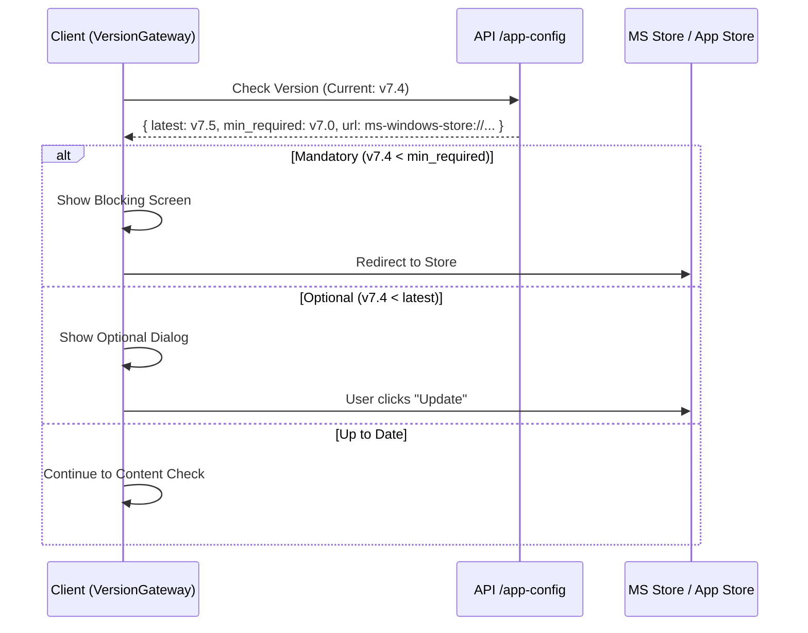
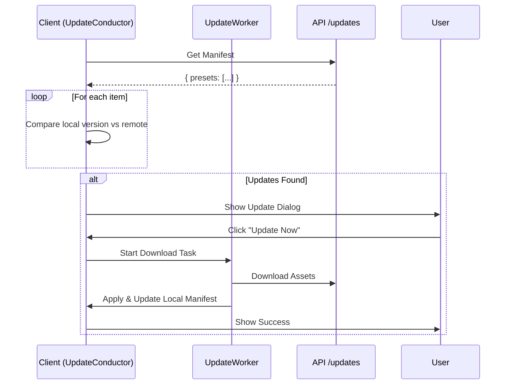

# Hybrid Update Architecture

## Overview

The application uses a **Hybrid Update System** that combines two distinct mechanisms to balance platform compliance with agility. This architecture ensures the app remains compliant with store guidelines (Microsoft Store, App Store) while allowing for rapid delivery of content updates (presets, AI estimators).

## Key Systems

| System | **Version Gateway** | **Content Updates** |
| :--- | :--- | :--- |
| **Target** | App Binary (`.exe`, `.app`) | Content (`.yaml`, `.json`) |
| **Scope** | Core features, UI, dependencies | Presets, Config |
| **Mechanism** | Store Redirect (Deep Link) | Direct Download (HTTPS) |
| **Frequency** | Low (Weeks/Months) | High (Days/Weeks) |
| **Compliance** | Full Store Compliance | Allowed (Dynamic Content) |
| **Conductor** | `VersionGatewayConductor` | `UpdateConductor` |

---

## 1. Version Gateway (App Updates)

This system handles updates to the application executable itself. Since the app is distributed via stores, it cannot self-update the binary. Instead, it acts as a "gateway" to the store.

### Architecture


### Components
- **Server**: `GET /api/v1/app-config?platform={os}`
- **Client**: `client/core/conductors/version_gateway_conductor.py`
- **UI**: 
  - `OptionalVersionUpdateDialog` (Dismissible)
  - `MandatoryVersionUpdateScreen` (Blocking, Full Screen)

---

## 2. Content Updates (Dynamic Assets)

This system handles "hot" updates to presets. This allows the app to adapt to changing social media specs (e.g., new TikTok dimensions) without waiting for a full store review cycle.

### Architecture


### Components
- **Server**: `/api/v1/updates/manifest`, `/api/v1/updates/download/*`
- **Client**: `client/core/conductors/update_conductor.py`
- **Worker**: `UpdateApplyWorker` (Async QThread)
- **UI**: `UpdateDialog` (Shows list of new presets)

---

## Integration in MainWindow

The two systems are orchestrated in `client/gui/main_window.py` to provide a seamless startup experience.

### Startup Flow
1.  **0ms**: App Launches
2.  **500ms**: `VersionGatewayConductor` checks app version.
    - *Blocking* if mandatory update required.
3.  **3000ms**: `UpdateConductor` checks content updates.
    - *Non-blocking* notification if new presets available.

### Manual Check
Triggered via "Check for Updates" in the title bar.
1.  Runs **Version Check** first.
2.  Then runs **Content Check** (1s delay).
3.  Provides feedback ("Checking...", "Up to date", etc.).

---

## Security & Auth

- **Version Gateway**: Public endpoint (startup check needs to work even if auth fails/expired).
- **Content Updates**: Authenticated via **JWT Token**.
  - `UpdateConductor.set_auth_token(jwt)` called after login.
  - Development fallback: `"FREE_TIER"` key.

---

## Configuration

**Server-Side** (`server/data/app_versions.json`):
```json
{
  "windows": {
    "latest_version": "7.5.0",
    "min_required_version": "7.0.0",
    "update_url": "ms-windows-store://..."
  }
}
```

**Client-Side** (`client/config/config.py`):
```python
APP_CONFIG_ENDPOINT = "/api/v1/app-config"
UPDATE_MANIFEST_ENDPOINT = "/api/v1/updates/manifest"
```
