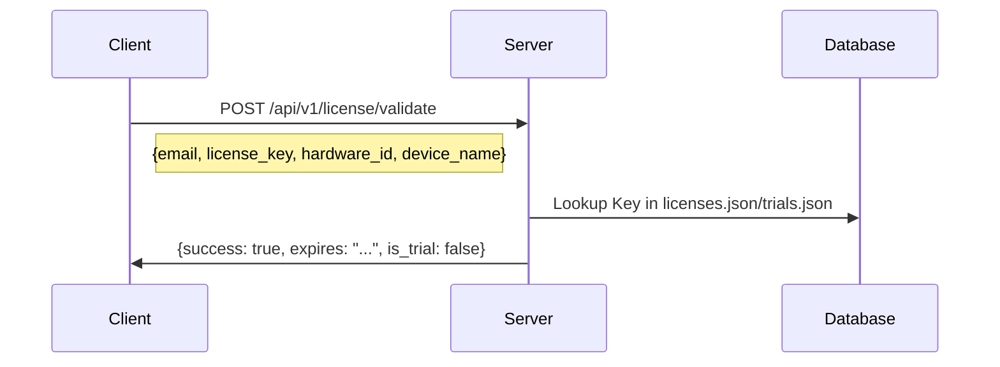
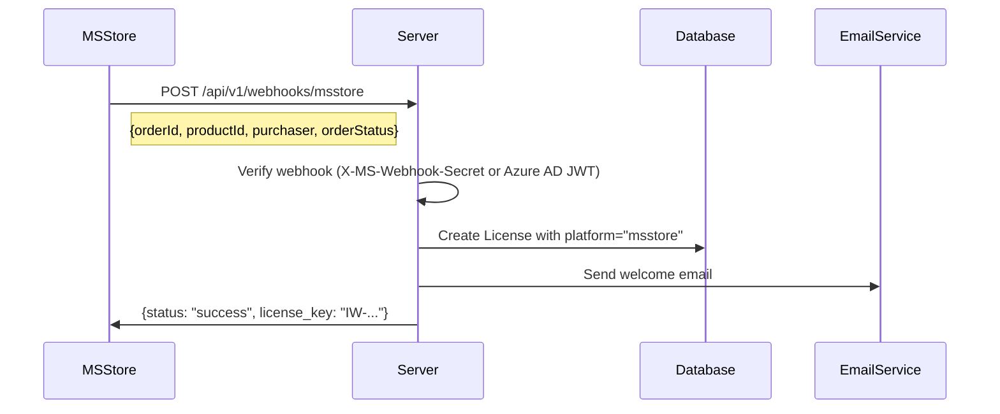

# Server Auth & Validation Architecture

## 1. Overview
The application uses a **Hybrid Authentication System** designed to support multiple distribution channels simultaneously:
1. **Microsoft Store**: Uses Windows StoreContext (Receipt Validation).
2. **Direct Sales (Stripe)**: Future integration for direct license key sales.
3. **Apple App Store**: Uses StoreKit 2 (Server-to-Server Verification) - *Stub only, awaiting Mac dev environment*.

The core philosophy is **Platform-Agnostic Licensing**: The server normalizes all purchases into a single `License` data structure, regardless of origin.

---

## 2. Server-Side Logic (`LicenseManager`)

### Data Model
The `LicenseManager` (`server/services/license_manager.py`) validates licenses based on a unified schema. It abstracts away the source of the purchase.

**Unified License Structure (Full):**
```json
{
  "email": "user@example.com",
  "created_date": "2025-01-01T00:00:00",
  "expiry_date": "2025-12-31T23:59:59",
  "is_active": true,
  "hardware_id": "HW-12345",
  "device_name": "My PC",
  "last_validation": "2025-01-15T10:00:00",
  "validation_count": 5,
  "source_license_key": null,
  "platform": "msstore",
  "platform_transaction_id": "order_abc123"
}
```

**Supported Platforms** (defined in `Platform` enum):
- `msstore` - Microsoft Store
- `stripe` - Future Stripe integration
- `direct` - Admin-created licenses
- `trial` - Free trials

### Webhook & Signal Handling
The server reacts to external signals (webhooks) from payment providers to create or update licenses.

**Flow:**
1.  **Webhook Received**:
    - MS Store: `POST /api/v1/webhooks/msstore`
2.  **Normalization**: Provider-specific payload is converted to standardized `purchase_info`.
3.  **License Creation**: `LicenseManager.create_license()` is called.
    -   Generates internal `IW-XXXXXX-XXXXXXXX` key.
    -   Stores `platform` and `platform_transaction_id`.
    -   Logs audit trail to `purchases.jsonl`.
4.  **Distribution**: Email sent to user via `EmailService`.

---

## 3. Client-Side Implementation (`StoreProvider`)

The client uses a **Provider Pattern** to abstract store-specific logic.

### Interface: `IStoreAuthProvider`
Defined in `client/core/auth/store_auth_provider.py`.

| Method | Returns | Description |
|--------|---------|-------------|
| `login()` | `AuthResult` | Trigger native login flow |
| `get_store_user_id()` | `Optional[str]` | Get unique platform user ID |
| `validate_receipt(receipt_data: bytes)` | `bool` | Verify purchase with backend |
| `is_authenticated()` | `bool` | Check if user is authenticated |

### Microsoft Store Implementation (`MSStoreProvider`)
Located in `client/core/auth/ms_store_provider.py`.

**Logic Flow:**
1.  **Login**: Calls `StoreContext.GetDefault().GetCustomerPurchaseIdAsync()` to retrieve the logged-in Microsoft user's ID.
2.  **Receipt Retrieval**: Fetches the AppReceipt from Windows.
3.  **Validation**: Would send the receipt to server for validation.
    -   *Current Status*: Implementation uses placeholders for `Windows.Services.Store` calls (`_store_available = False`).
4.  **Credentials**: Generates placeholder JWT-like tokens for development.

### Apple Store Implementation (`AppleStoreProvider`)
Located in `client/core/auth/apple_store_provider.py`.

**Current Status**: **STUB ONLY** - All methods raise `NotImplementedError`.
- Awaiting Mac development environment for StoreKit 2 implementation.

---

## 4. Communication & Validation Flow

### A. Direct License (Email/Admin)


### B. Microsoft Store (Webhook-Based)


### C. Offline Validation (Grace Period)
To support offline usage, `LicenseManager.validate_license()` implements a grace period strategy:
1.  **Online Check**: Success updates `last_validation` timestamp in license data.
2.  **Offline Check** (`is_offline=True`):
    -   If `last_validation` is < 3 days old: **ALLOW**
    -   If > 3 days: **BLOCK** (`offline_grace_expired` error)
    -   If no previous validation: **BLOCK** (`requires_online_validation` error)
3.  **Trial Restrictions**: Trials *always* require internet (`trial_requires_online` error).

---

## 5. Current Implementation Status

| Component | Status | Notes |
|-----------|--------|-------|
| **Server Data Model** | ✅ Ready | Full `Platform` enum, `platform_transaction_id` field. |
| **MS Store Webhooks** | ✅ Ready | Purchase, refund, cancellation handlers implemented. |
| **Trial System** | ✅ Ready | 7-day trials, eligibility checks, separate `trials.json` storage. |
| **Client Interface** | ✅ Ready | `IStoreAuthProvider` with 4 methods defined. |
| **MS Store Client** | 🚧 Placeholder | `_store_available = False`, needs `winrt` implementation. |
| **Apple Store Client** | ⏸️ Stub | All methods raise `NotImplementedError`. |
| **Receipt Validation Endpoint** | ❌ Missing | No `/api/v1/store/validate-receipt` endpoint exists. |
| **JWT Session Auth** | ❌ Not Implemented | Admin uses `X-Admin-Key` header; no JWT auth for regular users. |
| **Stripe Integration** | ⏸️ Planned | Future payment provider for direct sales. |

---

## 6. Recommendations

### Immediate Priority
1.  **Implement Receipt Validation Endpoint**: Create `POST /api/v1/store/validate-receipt` to:
    - Receive MS Store receipt from client
    - Verify with Microsoft Store Collections API
    - Return license key or create new license

2.  **Enable MS Store Native APIs**: Replace placeholders in `ms_store_provider.py` with actual `winrt` calls:
    ```python
    from winrt.windows.services.store import StoreContext
    store_context = StoreContext.get_default()
    ```

### Future Priority
3.  **Implement JWT Session Auth**: For Store users, issue short-lived JWT tokens (24h) after receipt validation.
4.  **Apple Store**: Implement when Mac development environment is available.
5.  **Stripe Integration**: Add direct sales capability with Stripe webhooks.

